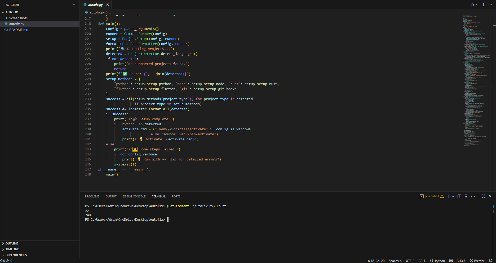
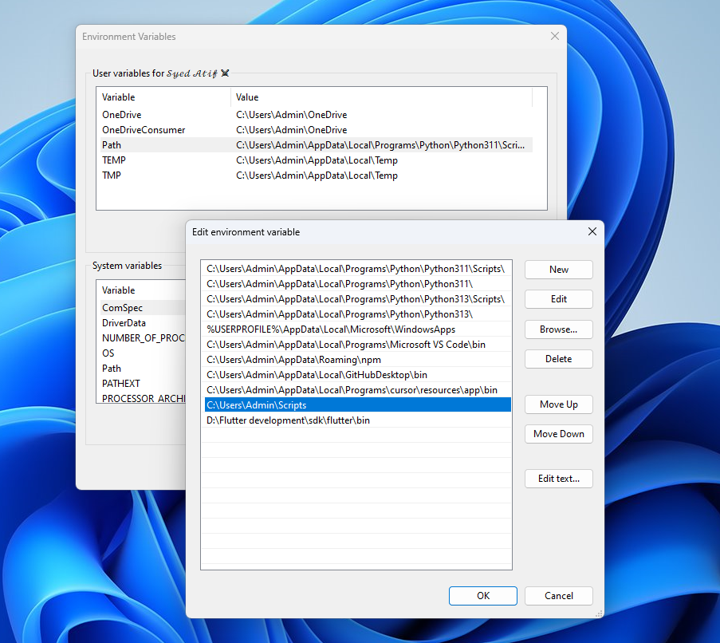
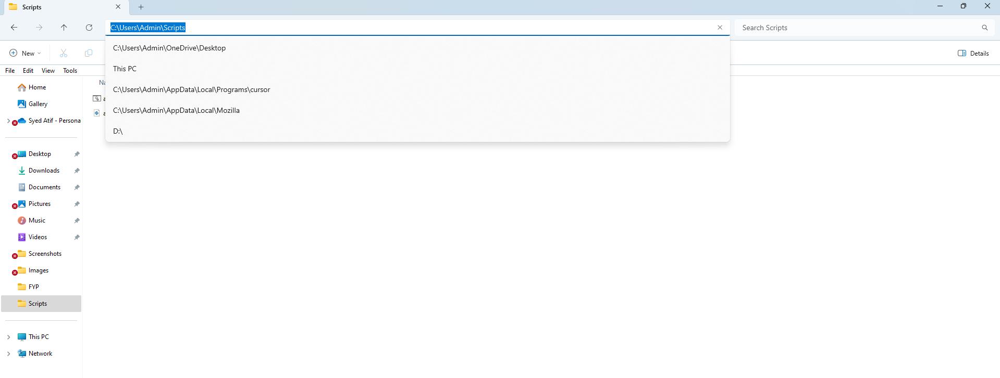
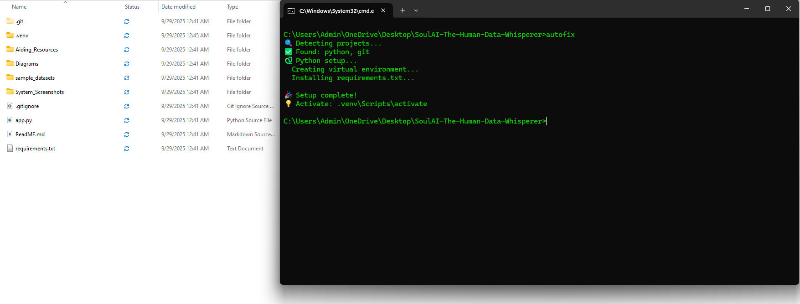
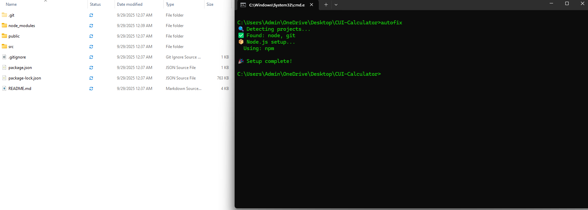
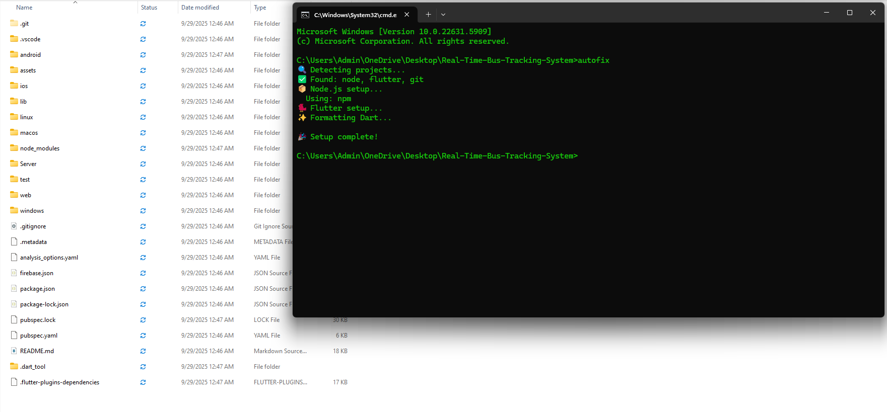

# 🚀 AutoFix: Smart Workspace Auto-Setup

> **A one-command tool that eliminates the 20-minute setup nightmare every developer faces when cloning a new repo.**

[](https://python.org)
[](LICENSE)
[]()

---

## ❌ The Problem

Every time developers clone a new repository, they face the same frustrating ritual:

- 🤔 **Which package manager do I use?** (npm, yarn, pnpm?)
- 🐍 **Do I need a Python virtual environment?**
- 📋 **What's the right sequence of commands?**
- 😤 **Why won't the dependencies install?**

This results in:
- ⏰ **20+ minutes of wasted setup time**
- 🔄 **Context switching between tools**
- 🐛 **Inconsistent environments causing bugs**

---

## ✅ The Solution

**AutoFix** is a single Python script that automatically detects your project type and sets up the perfect development environment with **zero configuration**.

> 💡 **One command. Every environment. Zero friction.**

---

## 📊 Line Count Verification



*Total lines of code: 247*

---

## ⚡ Installation & Usage

### Quick Start

```bash
# Download the script
curl -O https://raw.githubusercontent.com/ATIFSHAH159/Autofix-CLI-Development-Challenge-Hackathon/main/autofix.py

# Run in any project directory
python autofix.py
```

### PowerShell Users (Windows)

If you're using PowerShell, use this command instead:

```powershell
Invoke-WebRequest https://raw.githubusercontent.com/ATIFSHAH159/Autofix-CLI-Development-Challenge-Hackathon/main/autofix.py -OutFile autofix.py
```

### Global Installation (Recommended)

For convenience, you can install AutoFix globally:

1. **Create a Scripts folder** in permanent storage (e.g., `C:\Scripts\` or `D:\Scripts\`)
2. **Download autofix.py** to this folder
3. **Add the folder to your PATH** environment variable





After setup, you can run `autofix` from anywhere on your system!

---

## 🧑‍💻 Example Workflows

### 🐍 Python Project
```bash
cd my-python-project/
python autofix.py
```
**What it does:**
- ✅ Creates `.venv` virtual environment
- ✅ Installs dependencies from `requirements.txt` or `pyproject.toml`
- ✅ Sets up pre-commit hooks
- ✅ Formats code with Black & Ruff

### 📦 Node.js Project
```bash
cd my-react-app/
python autofix.py
```
**What it does:**
- ✅ Detects pnpm from `pnpm-lock.yaml`
- ✅ Runs `pnpm install`
- ✅ Sets up Prettier formatting
- ✅ Configures dev environment

### 🔄 Multi-Language Project (Python + Node.js)
```bash
cd fullstack-app/
python autofix.py
```
**What it does:**
- ✅ Detects Python backend + Node.js frontend
- ✅ Sets up both environments intelligently
- ✅ Configures all necessary tooling

### 🦀 Rust Project
```bash
cd my-rust-app/
python autofix.py
```
**What it does:**
- ✅ Detects `Cargo.toml`
- ✅ Runs `cargo build` / installs dependencies
- ✅ Configures Rust development environment

### 📱 Flutter Project
```bash
cd my-flutter-app/
python autofix.py
```
**What it does:**
- ✅ Detects Flutter project from `pubspec.yaml`
- ✅ Runs `flutter pub get`
- ✅ Automates build_runner if needed
- ✅ Configures Flutter environment for smooth development

---

## 📸 Screenshots

### Example 1: Python Project Setup


### Example 2: Node.js Project Setup


### Example 3: Multi-language Project Setup


---

## 🛠️ Supported Technologies

| Technology | Detection | Package Manager | Formatting |
|------------|-----------|-----------------|------------|
| **Python** | `requirements.txt`, `pyproject.toml`, `setup.py` | pip | Black, Ruff |
| **Node.js** | `package.json` | npm, yarn, pnpm | Prettier |
| **Rust** | `Cargo.toml` | cargo | Built-in |
| **Flutter** | `pubspec.yaml` | flutter pub | dart format |

---

## 🎯 Features

- 🔍 **Smart Detection**: Automatically identifies project types
- 🚀 **Zero Configuration**: Works out of the box
- 🔧 **Multi-Language Support**: Python, Node.js, Rust, Flutter
- 📦 **Package Manager Detection**: Automatically chooses the right tool
- ✨ **Code Formatting**: Sets up and runs formatters
- 🔗 **Git Hooks**: Configures pre-commit hooks
- 🪟 **Cross-Platform**: Windows, macOS, Linux support
- 📊 **Verbose Mode**: Detailed output with `-v` flag
- 🧪 **Dry Run**: Test without executing with `-n` flag


## 🤝 Contributing

Pull requests are welcome! If you'd like to add support for more languages or tools, open an issue first to discuss the changes.

### Development Setup

1. Fork the repository
2. Create a feature branch
3. Make your changes
4. Test with different project types
5. Submit a pull request

---

## 📜 License

MIT License – free to use and modify.

---

## 🙏 Acknowledgments

- Built for developers, by developers
- Inspired by the frustration of setting up new projects
- Special thanks to the open-source community

---

<div align="center">

**⭐ Star this repo if AutoFix saved you time! ⭐**
</div>
